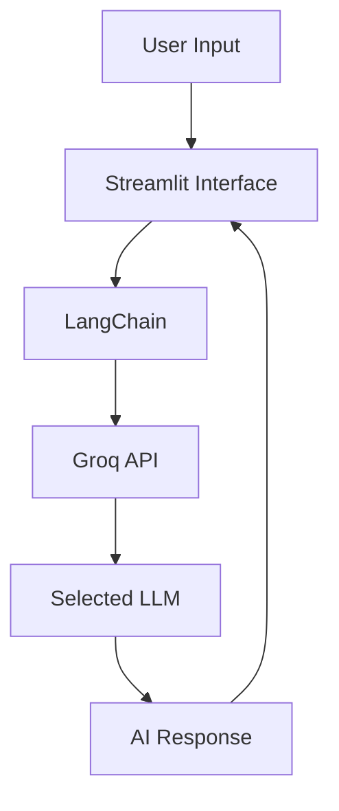

# 🤖 ChatBot AI

<div align="center">


<h1>🚀 ChatBot AI</h1>

<p>
A modern AI chatbot powered by <b>Groq</b>, <b>LangChain</b>, and <b>Streamlit</b>,
featuring multiple LLM support, customizable system prompts, temperature controls,
conversation export, and a futuristic user interface.
</p>

</div>

---

## 📸 Screenshots

### Home Page Interface

<p align="center">
  
</p>

### Main Chat Interface

<p align="center">
  
</p>

---

## ✨ Features

### 💬 Smart AI Conversations

- Real-time chatbot interaction
- Context-aware responses
- Persistent session history
- Clean chat interface

### ⚡ Lightning Fast Performance

- Powered by Groq Inference Engine
- Ultra-low latency responses
- Optimized for speed and efficiency

### 🧠 Multiple AI Models

Switch between:

- LLaMA 3.1 8B Instant
- LLaMA 3.3 70B Versatile
- Mixtral 8x7B
- Gemma 2 9B

### 🎛️ Advanced Controls

- Temperature Adjustment
- Dynamic Model Selection
- Custom System Prompts
- AI Personality Customization

### 📂 Chat Management

- Export Conversations
- Clear Chat History
- Session Statistics
- Message Tracking

### 🎨 Modern UI Design

- Futuristic Dark Theme
- Fully Responsive Layout
- Smooth Animations
- Premium User Experience

---

## 🏗️ Project Architecture

```text
┌─────────────┐
│    User     │
└──────┬──────┘
       │
       ▼
┌─────────────────┐
│ Streamlit Front │
└──────┬──────────┘
       │
       ▼
┌─────────────────┐
│   LangChain     │
└──────┬──────────┘
       │
       ▼
┌─────────────────┐
│    Groq API     │
└──────┬──────────┘
       │
       ▼
┌─────────────────┐
│ Selected Model  │
│ (LLaMA/Mixtral) │
└─────────────────┘
```

---

## 📁 Project Structure

```bash
ChatBot-AI/
│
├── app.py
├── basic.py
├── requirements.txt
├── README.md
├── .gitignore
├── .env.example
│
└── assets/
    ├── screenshot-1.png
    └── screenshot-2.png
```

---

## 🛠️ Tech Stack

| Technology | Purpose |
|------------|----------|
| Python | Backend Development |
| Streamlit | Frontend Interface |
| LangChain | LLM Framework |
| Groq | AI Inference |
| Python Dotenv | Environment Variables |

---

## ⚙️ Installation

### 1️⃣ Clone Repository

```bash
git clone https://github.com/yourusername/ChatBot-AI.git
cd ChatBot-AI
```

### 2️⃣ Create Virtual Environment

```bash
python -m venv venv
```

Activate Environment

**Windows**

```bash
venv\Scripts\activate
```

**Linux / macOS**

```bash
source venv/bin/activate
```

### 3️⃣ Install Dependencies

```bash
pip install -r requirements.txt
```

---

## 📦 Requirements

```txt
streamlit>=1.35.0
langchain>=0.3.0
langchain-groq>=0.2.0
python-dotenv>=1.0.0
```

---

## 🔑 Environment Variables

Create a `.env` file in the root directory.

```env
GROQ_API_KEY=your_groq_api_key_here
```

Get your API key from:

https://console.groq.com

---

## 🚀 Usage

### Run Streamlit Application

```bash
streamlit run app.py
```

Open your browser and visit:

```text
http://localhost:8501
```

---

### Run Terminal Version

```bash
python basic.py
```

Type:

```text
exit
```

to close the chatbot.

---

## 🎯 Supported Models

| Model | Description |
|---------|------------|
| llama-3.1-8b-instant | Fastest Response |
| llama-3.3-70b-versatile | Best Quality |
| mixtral-8x7b-32768 | Balanced Performance |
| gemma2-9b-it | Lightweight Model |

---

## 🌟 Key Functionalities

### Sidebar Features

- Model Selection
- Temperature Slider
- Custom System Prompt
- Export Chat
- Session Statistics

### Chat Features

- User & AI Message Bubbles
- Timestamped Messages
- Markdown Rendering
- Chat History Persistence

### Export Functionality

Export complete conversations as:

```markdown
chatbot_export.md
```

for future reference.

---

## 🔄 Workflow



---

## 🚀 Future Enhancements

- 📄 PDF Chat Support
- 🎤 Voice Assistant
- 🖼️ Image Understanding
- 💾 Database Storage
- 🔐 User Authentication
- 🌍 Multi-language Support
- ☁️ Cloud Deployment

---

## 🤝 Contributing

Contributions are welcome!

```bash
# Fork the repository

# Create feature branch
git checkout -b feature/amazing-feature

# Commit changes
git commit -m "Add amazing feature"

# Push branch
git push origin feature/amazing-feature
```

Then create a Pull Request 🚀

---

## 📜 License

This project is licensed under the MIT License.

---

## 👨‍💻 Author

Built with ❤️ using:

- Streamlit
- LangChain
- Groq
- LLaMA Models

---

<div align="center">

### ⭐ If you found this project useful, please give it a star!

Made with ❤️ and AI

</div>
